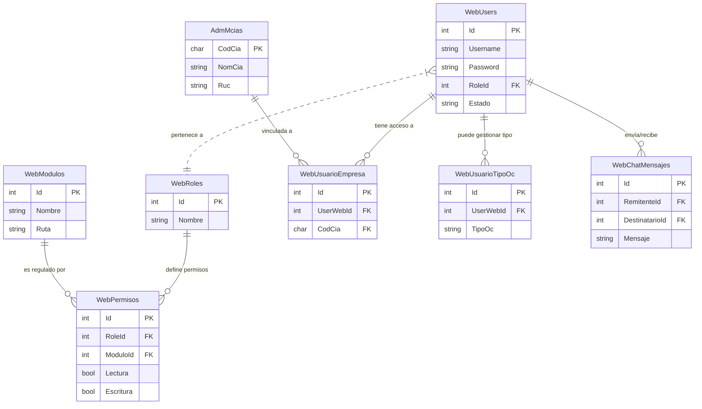
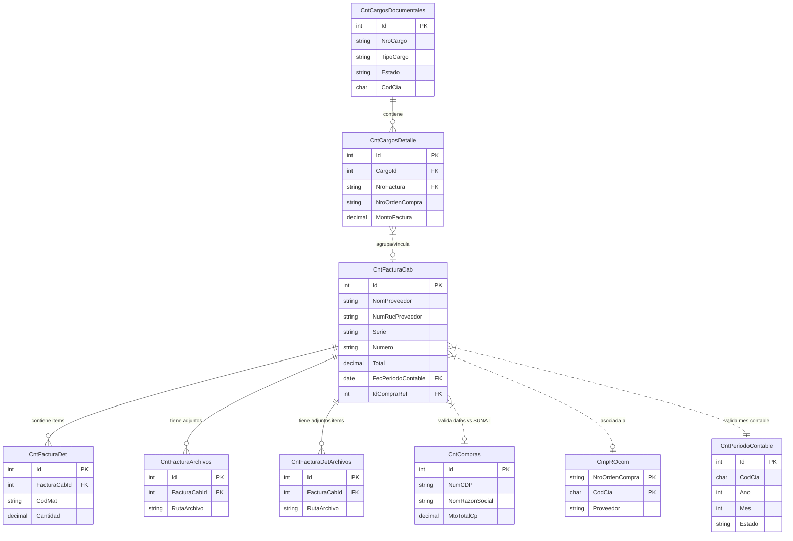
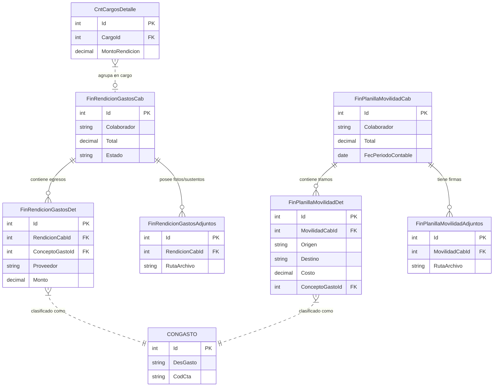
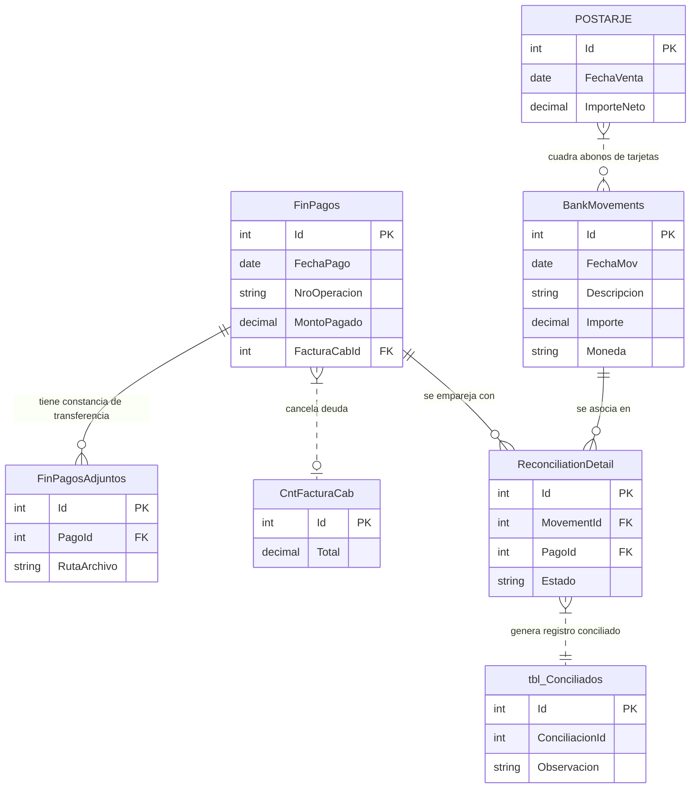
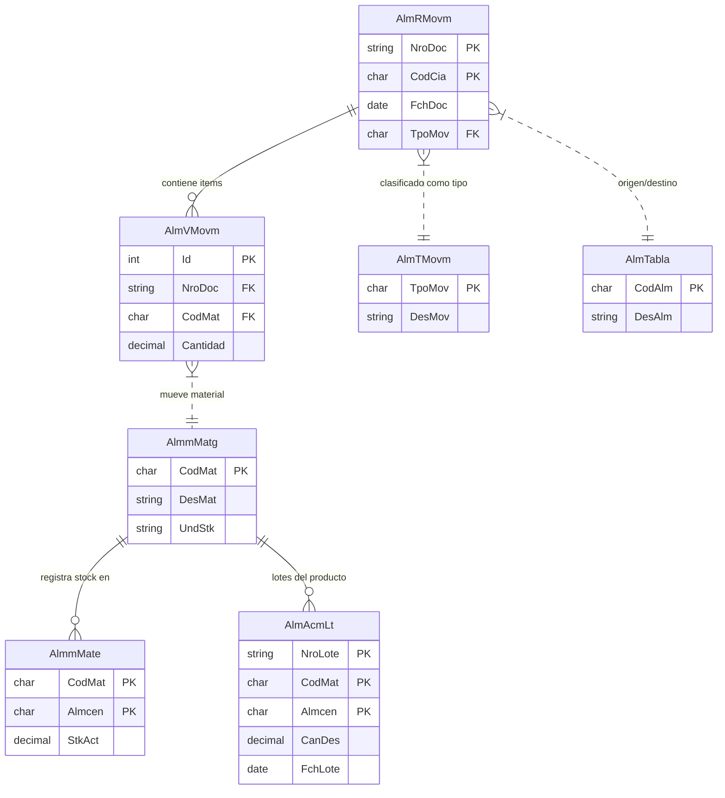
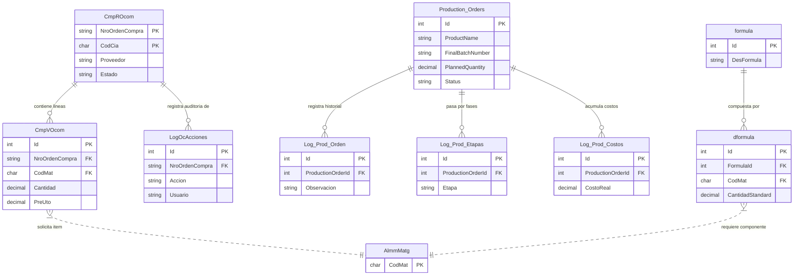
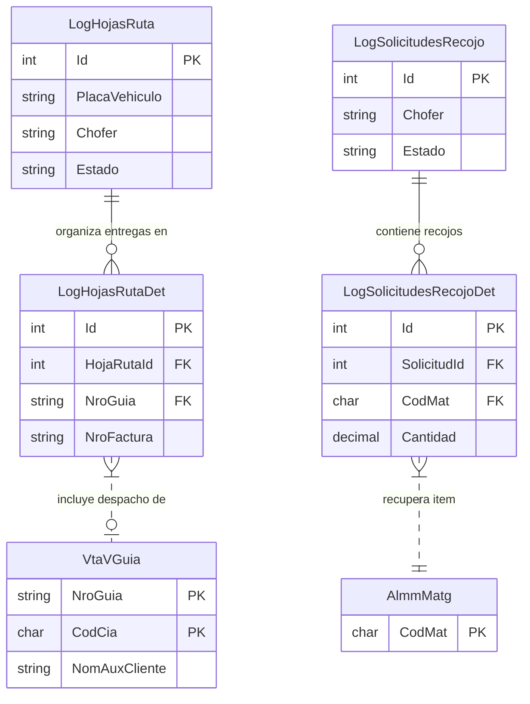

# Diagrama de Entidad-Relación (ER) - ERP Yelave

Este documento presenta los diagramas de entidad-relación que describen el modelo de datos activo ("amarrado") en el sistema web del ERP. 

Para facilitar la comprensión del diseño, los diagramas se han separado por módulos de negocio independientes utilizando un carrusel interactivo.

````carousel
### 1. Seguridad, Usuarios y Accesos
El módulo de seguridad gestiona la autenticación, los permisos granulares asignados a roles, el acceso a vistas específicas y la asociación de usuarios con empresas autorizadas del holding.


<!-- slide -->
### 2. Cuentas por Pagar (Cargos y Facturas)
Este sub-sistema permite la carga de facturas de proveedores, su verificación contra las compras informadas a SUNAT, y su agrupación lógica en "Cargos" para derivarlas a aprobación contable.


<!-- slide -->
### 3. Gastos, Rendiciones y Movilidad
Controla el flujo de caja chica, viáticos y gastos de movilidad del personal. Estos flujos también pueden agruparse en los Cargos Documentales para pase a pago.


<!-- slide -->
### 4. Tesorería, Pagos y Conciliación Bancaria
Registra los desembolsos de dinero (pagos) para liquidar facturas y rendiciones, y permite conciliar dichos pagos contra los extractos reales de cuentas bancarias.


<!-- slide -->
### 5. Almacén, Lotes e Inventario (Kardex)
Define el catálogo de materias primas y productos, el almacenamiento detallado por lotes, y los movimientos de entrada, salida y saldo (Kardex).


<!-- slide -->
### 6. Logística, Compras (OC) y Producción
Representa el flujo de abastecimiento y manufactura del negocio. Las Órdenes de Compra (OC) y los pedidos de manufactura generan los lotes de stock de la planta.


<!-- slide -->
### 7. Distribución, Despacho y Reparto
Mapea el transporte y entrega de pedidos facturados por el área comercial utilizando Hojas de Ruta de los transportistas asignados.


````
